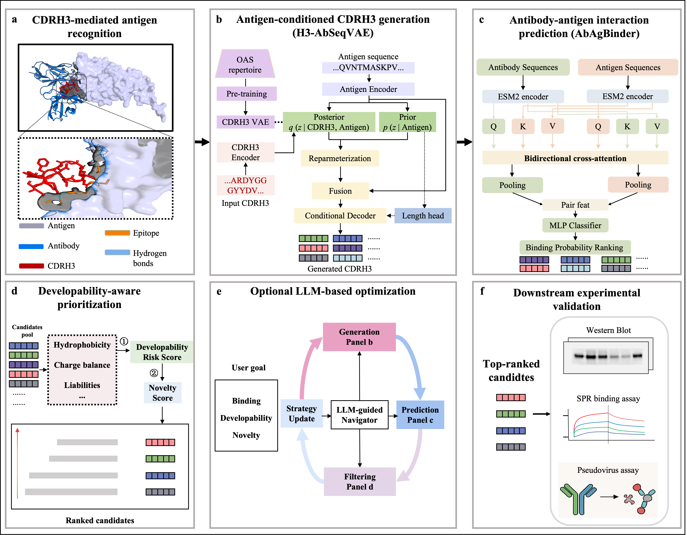

# SPACE-antibody-design

Implementation of the framework described in:

**SPACE: A Unified Framework for Multi-Constraint Antigen-Specific Antibody Design Operating in Sequence Space**

SPACE is a sequence-based platform for antigen-specific antibody design that integrates:

- **H3-AbSeqVAE**: antigen-conditioned CDRH3 sequence generation
- **AbAgBinder**: antibody–antigen interaction prediction
- **Developability-aware screening**: candidate prioritization using sequence-derived developability metrics

<p align="center">
  
</p>

## Framework Overview

SPACE consists of three major components:

### 1. Repertoire-informed CDRH3 Generation

- VAE pretraining on large-scale antibody repertoires
- Antigen-conditioned CVAE fine-tuning

### 2. Antibody–Antigen Interaction Prediction

- ESM2 protein language model embeddings
- Bidirectional cross-attention modeling

### 3. Developability-aware Candidate Prioritization

- Rule-based liability filtering
- Multi-objective ranking based on binding and developability

## Quick Start

### Train Models

Train the repertoire VAE:

```bash
python code/train/train_cdrh3_vae.py
```

Train the antigen-conditioned CVAE:

```bash
python code/train/train_conditional_cvae.py
```

Train AbAgBinder:

```bash
python code/train/train_esm2_cross_attention.py
```

### Online Web Application

https://antibody-design.vercel.app

## Pretrained Models

The repository includes:

```text
checkpoints/best_esm2_cross_attention.pt
```

This checkpoint was trained using:

```text
esm2_t12_35M_UR50D
```

for demonstration and reproducibility purposes.

Larger checkpoints trained with:

```text
esm2_t33_650M_UR50D
```

are available through Google Drive:

- best_esm2_cross_attention.pt
- best_esm2_cross_attention_regression.pt
- best_esm2_cross_attention_regression_fixed_antigen.pt

Downloads:

- https://drive.google.com/file/d/14ZK1tzs6QaPVj8i74B2Rzhb3JpxOE25r/view?usp=drive_link,
- https://drive.google.com/file/d/1ZZQzJYHQ37Zc1KjwqAsiiYMyB8yyORGY/view?usp=drive_link,
- https://drive.google.com/file/d/1SdkpORkcsUErk5c2iiNBYlkyTVKrbPLN/view?usp=drive_link.

After downloading, place the files in:

```text
checkpoints/
```

## Hardware Requirements

### Recommended

- GPU: NVIDIA A100
- CPU: ≥ 8 cores
- RAM: ≥ 32 GB
- Storage: ≥ 20 GB

### Software Requirements

- Ubuntu 20.04 / Linux / macOS
- Python ≥ 3.9


### Main Dependencies

- PyTorch
- Transformers ≥ 4.30
- FastAPI
- Uvicorn
- NumPy
- Pandas
- Scikit-learn
- Matplotlib
- Seaborn
- OpenAI API
- ANARCI (for CDRH3 extraction)

## Dataset Availability

### Repertoire Pretraining Dataset

The file:

```text
covid_human_heavy_cdr3_aa_unique_len4_30.txt
```

contains a non-redundant collection of human SARS-CoV-2-associated heavy-chain CDRH3 sequences derived from the Observed Antibody Space (OAS) database.

Processing steps:

1. Removal of empty entries
2. Removal of non-canonical amino acid characters
3. Global deduplication
4. Retention of sequences between 4 and 30 amino acids

Download:

https://drive.google.com/file/d/1n46ld31QrC9oYlZVsR7JZsoOgX_TFupc/view?usp=drive_link.

### Antigen-Specific Datasets

Antibody–antigen complexes were collected from the SAbDab database for:

- HIV gp120
- HIV gp160
- Influenza Hemagglutinin (HA)
- Influenza Neuraminidase (NA)
- Plasmodium Circumsporozoite Protein (CSP)

Processed datasets are available under:

```text
data/raw/
```

For each complex, IMGT-numbered CDRH3 sequences were extracted.

Negative samples were generated using a dissimilarity-based sampling strategy with a sequence identity threshold below 60%.

## License

This project is released under the MIT License.

See the LICENSE file for details.

## Contact

**Fanxu Meng**

Email: f.meng@vu.nl
